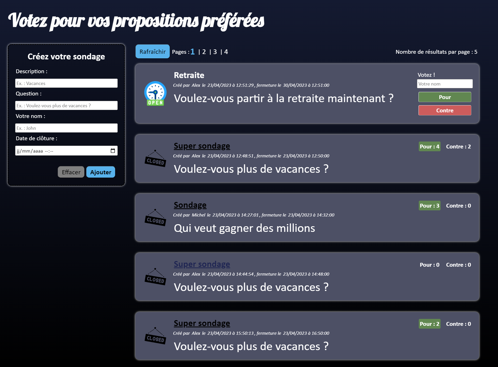
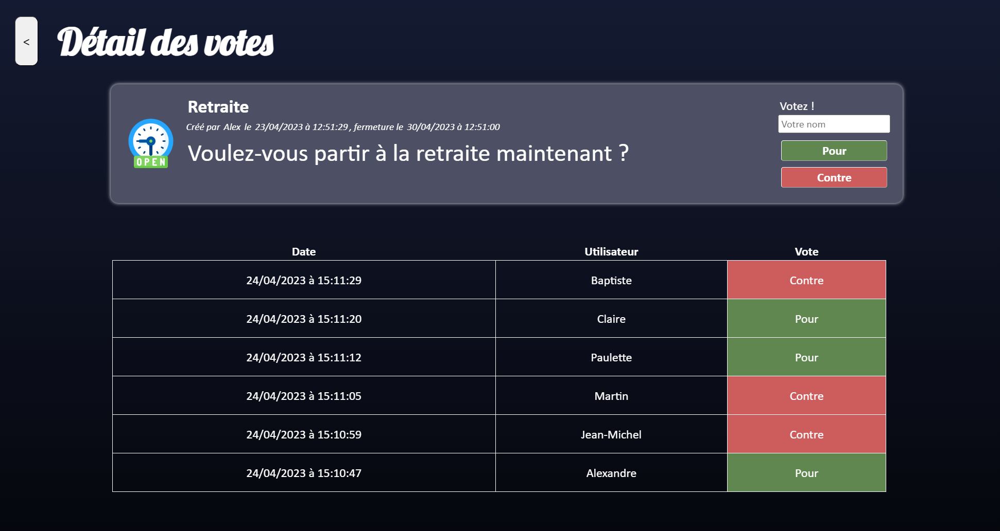
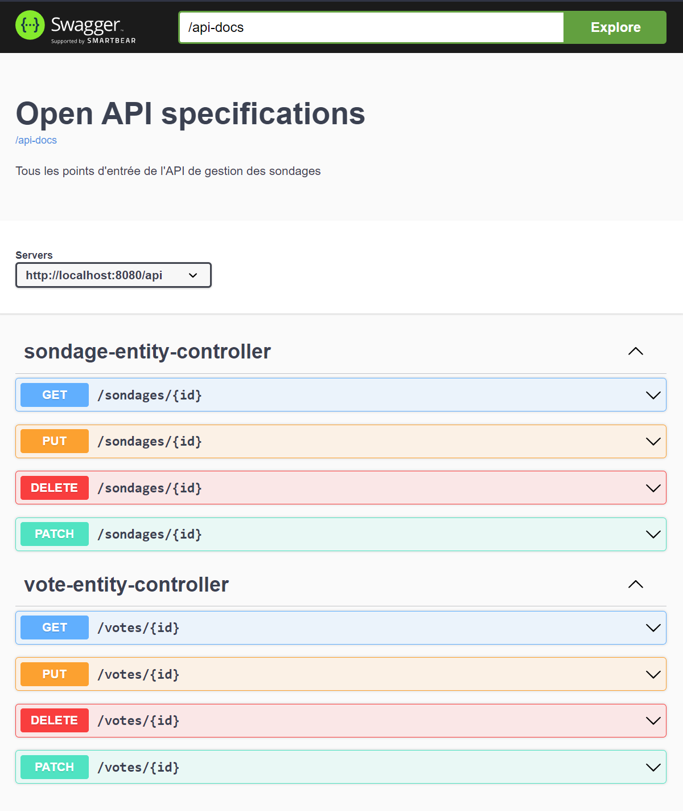

# Sondages

Système de votes à bulletins découverts. Les utilisateurs voient une liste 
de propositions et peuvent voter oui/non sur chacune.



Quand un utilisateur a voté, il a accès aux résultats du vote. Lorsqu'un 
sondage est terminé, on ne peut plus voter et le nombre de "pour" ou 
"contre" est affiché sur la page d'accueil.



## Guide utilisateur

### Configuration

Le système de sondages a besoin d'une base de données pour fonctionner. 
Créez un nouveau schéma sur votre base préférée, puis indiquez les bonnes 
informations dans le fichier `application.properties` :

Exemple pour MySQL :
```properties
spring.datasource.url=jdbc:mysql://localhost:3306/sondages
spring.datasource.username=root
spring.datasource.password=root
spring.datasource.driver-class-name=com.mysql.cj.jdbc.Driver
```

Pour lancer l'application avec maven, utilisez la cible `mvn deploy`.
Pour la lancer depuis IntelliJ, lancez la classe `SondagesApplication`.

### Utilisation

Pour créer un nouveau sondage, utiliser le formulaire à gauche de la page 
d'accueil. Tous les champs demandés sont obligatoires. Indiquez une question 
qui attend une réponse **Oui** ou **Non**.

Pour voter vous n'avez pas besoin d'être identifié mais vous devez indiquer un
nom différent à chaque vote car il est évidemment interdit de voter plusieurs
fois avec le même nom d'utilisateur sur un même sondage.

## Développeurs

### API

Par défaut l'API est documentée sur l'URL `http://localhost:8080/swagger-ui.html`.



- Les services RESTFul (CRUD) pour les sondages sont disponibles sur l'URL 
`/api/sondages`.

- L'URL pour voter est acceissible sur `POST /api/votes/{sondageId}` où 
`{sondageId}` doit être remplacé par le sondage sur lequel vous voulez voter.

### Technologies utilisées

L'application est développée avec Spring Boot (voir le détail des packages 
utilisés [/HELP.md](ici)).

* [Thymeleaf](https://docs.spring.io/spring-boot/docs/3.0.5/reference/htmlsingle/#web.servlet.spring-mvc.template-engines)
* [Validation](https://docs.spring.io/spring-boot/docs/3.0.5/reference/htmlsingle/#io.validation)
* [Spring REST Docs](https://docs.spring.io/spring-restdocs/docs/current/reference/html5/)
* [Spring Web](https://docs.spring.io/spring-boot/docs/3.0.5/reference/htmlsingle/#web)
* [Spring Data JPA](https://docs.spring.io/spring-boot/docs/3.0.5/reference/htmlsingle/#data.sql.jpa-and-spring-data)
